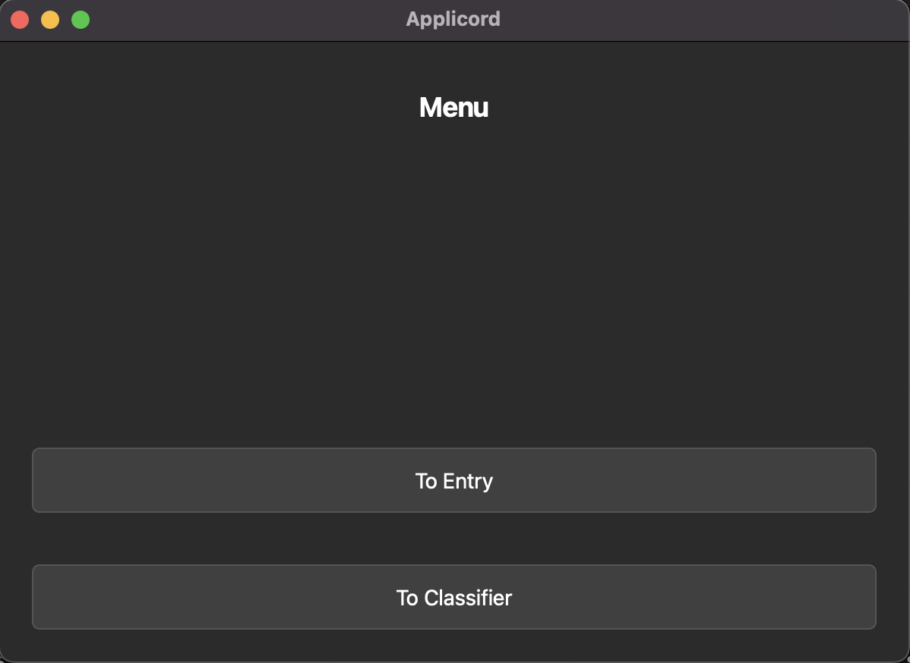
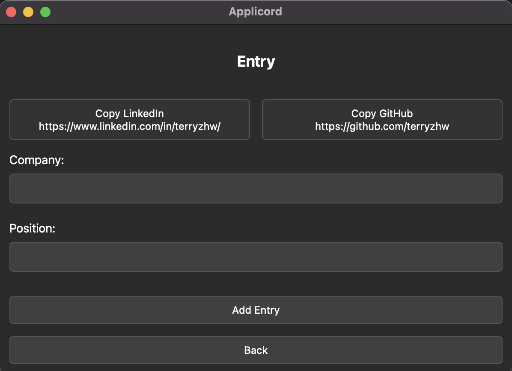
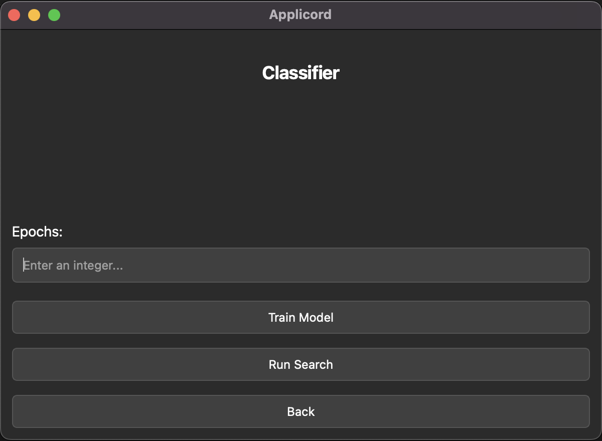
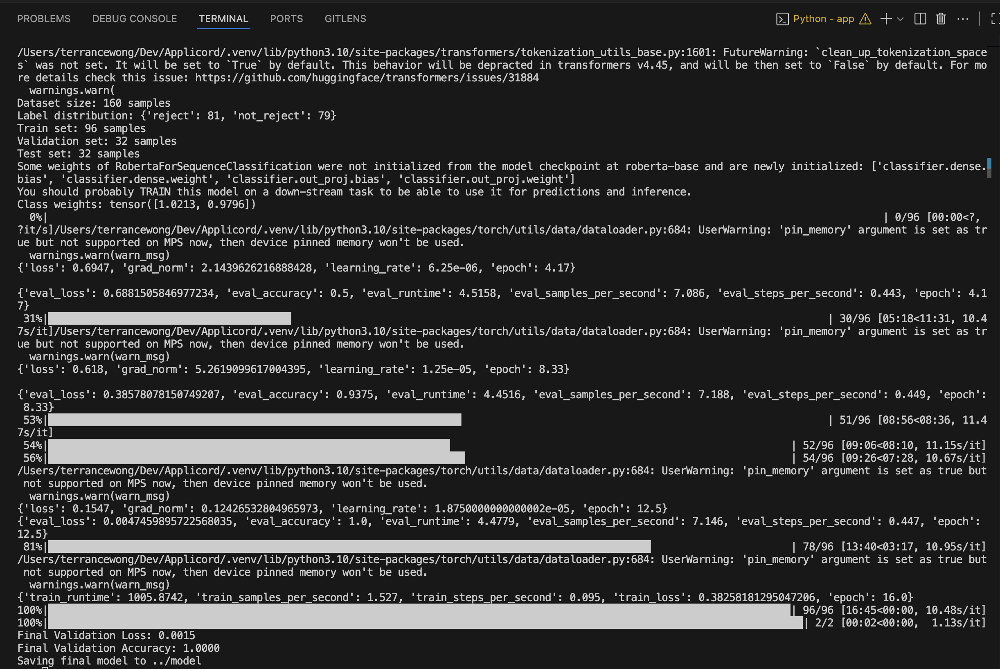
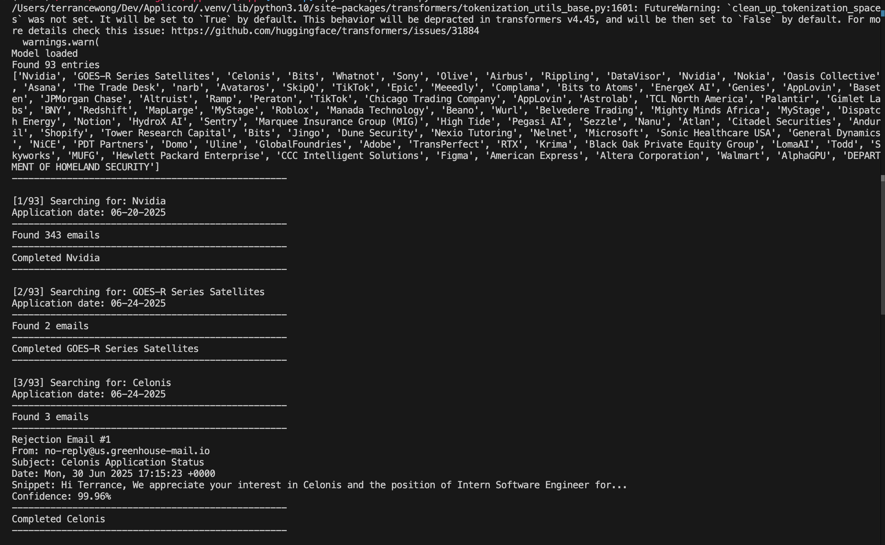

# Applicord

## Introduction

Applicord is a desktop application designed to efficiently track job applications by automatically logging them to Google Sheets and analyzing email responses. Built with PyQt5, it provides a clean interface for managing your job search process while leveraging machine learning to identify rejection emails automatically.

## Features

- **Application Tracking**: Log job applications directly to Google Sheets with company, position, date, and status
- **Smart Email Classification**: AI-powered RoBERTa model to automatically identify rejection emails
- **Gmail Integration**: Search and analyze emails from companies you've applied to
- **Automatic Status Updates**: Automatically update application status to "Rejected" when rejection emails are detected
- **Quick Profile Access**: One-click copying of LinkedIn and GitHub profiles for applications
- **Batch Processing**: Process multiple companies and their emails at once
- **Date Filtering**: Search emails within specific date ranges based on application dates

## Installation

### Prerequisites

- Python 3.7+ (I use 3.10.11)
- Google account with Gmail and Google Sheets access
- Git

### Setup

1. **Clone the repository**:

2. **Install dependencies**:
```bash
pip install -r requirements.txt
```

3. **Set up Google API credentials**:
   - Create a project in the [Google Cloud Console](https://console.cloud.google.com/)
   - Enable Gmail API and Google Sheets API
   - Create credentials (OAuth 2.0) and download as `credentials.json`
   - Place `credentials.json` in the project root directory

4. **Configure environment variables**:
   Create a `.env` file in the root directory with:
```bash
SPREADSHEET_ID=your_google_sheet_id
WORKSHEET_NAME=your_worksheet_name
CREDENTIALS=credentials.json
```

5. **Run the application**:
```bash
python app/applicord.py
```

## Usage

### Basic Application Tracking

1. **Launch Applicord** and click "Entry" from the main menu
2. **Enter company name and position** you're applying for
3. **Click "Add Entry"** to log the application to your Google Sheet
4. The application will be automatically logged with today's date and "Submitted" status

### Email Analysis

1. **Train the classifier**:
   - Navigate to the "Classifier" page
   - Prepare a CSV file with email samples labeled as "reject" or "not_reject" (You can find a good dataset from Kaggle)
   - Train the model on your data

2. **Search for rejection emails**:
   - The application automatically searches emails from companies in your spreadsheet
   - Rejection emails are identified using the trained model
   - Company statuses are automatically updated when rejections are found

### Model Training

The application uses a RoBERTa-based classifier for email analysis:

- **Dataset Format**: CSV with "Email" and "Status" columns
- **Labels**: "reject" for rejection emails, "not_reject" for others
- **Training**: Supports class balancing, early stopping, and hyperparameter tuning
- **Evaluation**: Built-in test set evaluation with accuracy metrics

## Project Structure

```
app/
├── applicord.py           # Main application entry point
├── gui/                   # User interface components
│   ├── windows.py         # Main window controller
│   ├── menu_page.py       # Main menu interface
│   ├── entry_page.py      # Application entry form
│   └── classifier_page.py # Model training interface
├── ml/                    # Machine learning components
│   └── email_classifier.py # RoBERTa email classifier
├── search/                # Email processing
│   └── email_search.py    # Gmail API integration
├── sheet/                 # Spreadsheet management
│   └── sheet_manager.py   # Google Sheets integration
└── utils/                 # Utility modules
    ├── credential_manager.py # OAuth credential handling
    ├── date.py            # Date processing utilities
    └── styles.py          # UI styling
```

## Dependencies

- **PyQt5**: Desktop GUI framework
- **Google APIs**: Gmail and Sheets integration
- **Transformers**: Hugging Face transformers for ML
- **PyTorch**: Deep learning framework
- **Pandas**: Data manipulation
- **Scikit-learn**: ML utilities

## Gallery

<p align="center">
  
  
  
  
  
</p>

## Support

If you encounter any issues or have questions about Applicord, please open an issue on the GitHub repository.

## License

MIT

---

> Developed by Terrance Wong
